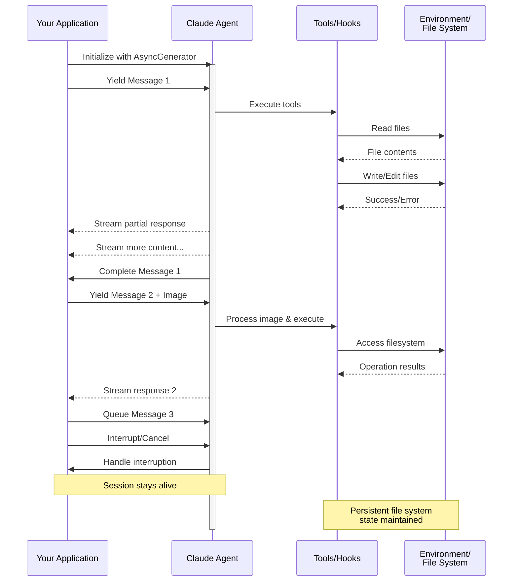

> ## Documentation Index
> Fetch the complete documentation index at: https://code.claude.com/docs/llms.txt
> Use this file to discover all available pages before exploring further.

# 스트리밍 입력 (Streaming Input)

> Claude Agent SDK의 두 가지 입력 모드와 각각을 사용해야 하는 시기 이해하기

## 개요 (Overview)

Claude Agent SDK는 에이전트와 상호작용하기 위해 두 가지 고유한 입력 모드를 지원합니다:

* **스트리밍 입력 모드 (Streaming Input Mode)** (기본값 및 권장 사항) - 지속적인 대화형 세션
* **단일 메시지 입력 (Single Message Input)** - 세션 상태 및 재개를 사용하는 단일 실행(one-shot) 쿼리

이 가이드에서는 애플리케이션에 적합한 접근 방식을 선택하는 데 도움이 되도록 각 모드의 차이점, 이점 및 유스케이스를 설명합니다.

## 스트리밍 입력 모드 (권장)

스트리밍 입력 모드는 Claude Agent SDK를 사용하는 **선호되는** 방식입니다. 에이전트 기능에 대한 전체 접근 권한을 제공하며 풍부한 대화형 환경을 가능하게 합니다.

이를 통해 에이전트는 사용자 입력을 받아들이고, 중단을 처리하고, 권한 요청을 노출하며, 세션을 관리하는 오래 실행되는 프로세스로 작동할 수 있습니다.

### 작동 방식



### 이점

<CardGroup cols={2}>
  <Card title="이미지 업로드" icon="image">
    시각적 분석 및 이해를 위해 메시지에 이미지를 직접 첨부
  </Card>

  <Card title="대기열 메시지" icon="stack">
    중단 기능과 함께 순차적으로 처리되는 여러 메시지 전송
  </Card>

  <Card title="도구 통합" icon="wrench">
    세션 동안 모든 도구 및 커스텀 MCP 서버에 대한 전체 접근
  </Card>

  <Card title="실시간 피드백" icon="lightning">
    최종 결과뿐만 아니라 생성되는 즉시 응답 확인
  </Card>

  <Card title="컨텍스트 지속성" icon="database">
    여러 차례에 걸쳐 대화 컨텍스트를 자연스럽게 유지
  </Card>
</CardGroup>

### 구현 예시

이 예시는 작업 디렉터리에서 `diagram.png`라는 이미지를 읽습니다. 거기에 먼저 이미지를 생성하거나 자체 이미지를 가리키도록 파일 이름을 변경하세요.

<CodeGroup>
  ```typescript TypeScript theme={null}
  import { query, type SDKUserMessage } from "@anthropic-ai/claude-agent-sdk";
  import { readFile } from "fs/promises";

  async function* generateMessages(): AsyncGenerator<SDKUserMessage> {
    // 첫 번째 메시지
    yield {
      type: "user",
      message: {
        role: "user",
        content: "Analyze this codebase for security issues"
      },
      parent_tool_use_id: null
    };

    // 조건 또는 사용자 입력 대기
    await new Promise((resolve) => setTimeout(resolve, 2000));

    // 이미지가 포함된 후속 메시지
    yield {
      type: "user",
      message: {
        role: "user",
        content: [
          {
            type: "text",
            text: "Review this architecture diagram"
          },
          {
            type: "image",
            source: {
              type: "base64",
              media_type: "image/png",
              data: await readFile("diagram.png", "base64")
            }
          }
        ]
      },
      parent_tool_use_id: null
    };
  }

  // 스트리밍 응답 처리
  for await (const message of query({
    prompt: generateMessages(),
    options: {
      maxTurns: 10,
      allowedTools: ["Read", "Grep"]
    }
  })) {
    if (message.type === "result" && message.subtype === "success") {
      console.log(message.result);
    }
  }
  ```

  ```python Python theme={null}
  from claude_agent_sdk import (
      ClaudeSDKClient,
      ClaudeAgentOptions,
      AssistantMessage,
      TextBlock,
  )
  import asyncio
  import base64


  async def streaming_analysis():
      async def message_generator():
          # 첫 번째 메시지
          yield {
              "type": "user",
              "message": {
                  "role": "user",
                  "content": "Analyze this codebase for security issues",
              },
          }

          # 조건 대기
          await asyncio.sleep(2)

          # 이미지가 포함된 후속 메시지
          with open("diagram.png", "rb") as f:
              image_data = base64.b64encode(f.read()).decode()

          yield {
              "type": "user",
              "message": {
                  "role": "user",
                  "content": [
                      {"type": "text", "text": "Review this architecture diagram"},
                      {
                          "type": "image",
                          "source": {
                              "type": "base64",
                              "media_type": "image/png",
                              "data": image_data,
                          },
                      },
                  ],
              },
          }

      # 스트리밍 입력을 위해 ClaudeSDKClient 사용
      options = ClaudeAgentOptions(max_turns=10, allowed_tools=["Read", "Grep"])

      async with ClaudeSDKClient(options) as client:
          # 스트리밍 입력 전송
          await client.query(message_generator())

          # 응답 처리
          async for message in client.receive_response():
              if isinstance(message, AssistantMessage):
                  for block in message.content:
                      if isinstance(block, TextBlock):
                          print(block.text)


  asyncio.run(streaming_analysis())
  ```
</CodeGroup>

예시를 실행하면 TypeScript 버전은 완료될 때마다 각 응답을 출력합니다. Python 버전의 `receive_response()` 루프는 첫 번째 결과 메시지에서 종료되므로 보안 분석을 출력합니다. 두 응답을 모두 읽으려면 [Python 레퍼런스의 대화 계속 진행 예시](/docs/en/agent-sdk/python#example-continuing-a-conversation)에 나와 있는 것처럼 메시지당 하나의 `query()` 및 `receive_response()` 쌍을 사용하세요.

<Note>
  TypeScript SDK에서 메시지 생성기가 에러를 발생시키는 경우(예: 읽으려는 파일이 없는 경우), 스트림은 원래 에러 대신 `Claude Code process aborted by user` 에러와 함께 종료되므로 해당 메시지가 보이면 먼저 생성기 내부 코드를 확인하세요. 에러에 앞서 번들로 제공되는 SDK 소스의 긴 축소된 줄이 나타날 수도 있으므로 에러 텍스트는 출력 끝까지 읽어보세요.

  Python SDK에서 생성기 예외는 디버그 수준으로 로깅되고 세션은 예외를 발생시키지 않고 중단되므로, 스트리밍 세션이 출력 없이 멈추는 경우 디버그 로깅을 활성화하고 생성기를 확인하세요.
</Note>

## 단일 메시지 입력 (Single Message Input)

단일 메시지 입력은 더 간단하지만 제한적입니다.

### 단일 메시지 입력을 사용해야 하는 경우

다음과 같은 경우 단일 메시지 입력을 사용하세요:

* 단일 실행(one-shot) 응답이 필요한 경우
* 이미지 첨부 파일이나 세션 중간 제어 메서드가 필요하지 않은 경우
* Lambda 함수와 같이 상태가 없는 환경에서 작동해야 하는 경우

### 제한 사항

<Warning>
  단일 메시지 입력 모드는 다음을 지원하지 **않습니다**:

  * 메시지의 직접적인 이미지 첨부
  * 동적 메시지 대기열
  * 실시간 중단
  * 자연스러운 다중 대화(multi-turn conversations)
</Warning>

`error_max_turns`와 같은 오류 결과로 쿼리가 끝나는 경우 단일 메시지 `query()` 호출은 최종 결과 메시지를 출력한 후 오류를 발생시키므로, 코드가 계속 진행되어야 하는 경우 루프를 try 블록으로 감싸세요. 결과 서브타입에 대해서는 [결과 처리](/docs/en/agent-sdk/agent-loop#handle-the-result)를 참조하세요.

### 구현 예시

<CodeGroup>
  ```typescript TypeScript theme={null}
  import { query } from "@anthropic-ai/claude-agent-sdk";

  // 간단한 단일 실행 쿼리
  // query()는 error_max_turns와 같은 오류 결과 이후 에러를 발생시킵니다
  try {
    for await (const message of query({
      prompt: "Explain the authentication flow",
      options: {
        maxTurns: 5,
        allowedTools: ["Read", "Grep"]
      }
    })) {
      if (message.type === "result" && message.subtype === "success") {
        console.log(message.result);
      }
    }
  } catch (error) {
    console.error(`Query failed: ${error}`);
  }

  // 세션 관리를 사용하여 대화 계속 진행
  try {
    for await (const message of query({
      prompt: "Now explain the authorization process",
      options: {
        continue: true,
        maxTurns: 5
      }
    })) {
      if (message.type === "result" && message.subtype === "success") {
        console.log(message.result);
      }
    }
  } catch (error) {
    console.error(`Query failed: ${error}`);
  }
  ```

  ```python Python theme={null}
  from claude_agent_sdk import query, ClaudeAgentOptions, ResultMessage
  import asyncio


  async def single_message_example():
      # query() 함수를 사용한 간단한 단일 실행 쿼리
      # query()는 error_max_turns와 같은 오류 결과 이후 에러를 발생시킵니다
      try:
          async for message in query(
              prompt="Explain the authentication flow",
              options=ClaudeAgentOptions(max_turns=5, allowed_tools=["Read", "Grep"]),
          ):
              if isinstance(message, ResultMessage) and message.subtype == "success":
                  print(message.result)
      # SDK는 오류 결과에 대해 일반 Exception을 발생시키므로 여기서 Exception 매칭
      except Exception as e:
          print(f"Query failed: {e}")

      # 세션 관리를 사용하여 대화 계속 진행
      try:
          async for message in query(
              prompt="Now explain the authorization process",
              options=ClaudeAgentOptions(continue_conversation=True, max_turns=5),
          ):
              if isinstance(message, ResultMessage) and message.subtype == "success":
                  print(message.result)
      except Exception as e:
          print(f"Query failed: {e}")


  asyncio.run(single_message_example())
  ```
</CodeGroup>

예시를 실행하면 각 쿼리가 최종 결과 텍스트를 출력합니다. 먼저 인증 설명이 출력되고 그 다음 권한 부여 설명이 출력됩니다.
